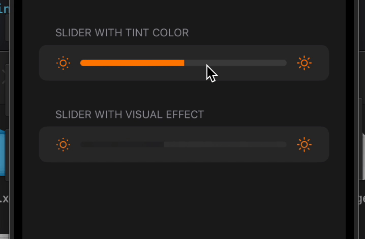

# FluidSliderIOS
Example of using the new slider from iOS 17, which Apple uses in AVPlayerViewController, Control Center, and Apple Music.

<strong>Requires iOS 17+</strong>

<table>
   <tr>
      <td></td>
   </tr>
</table>

# Credits
<li>Headers: https://github.com/MTACS/iOS-17-Runtime-Headers/</li>
<li>Example: https://x.com/sebjvidal/status/1878372898068369544</li>